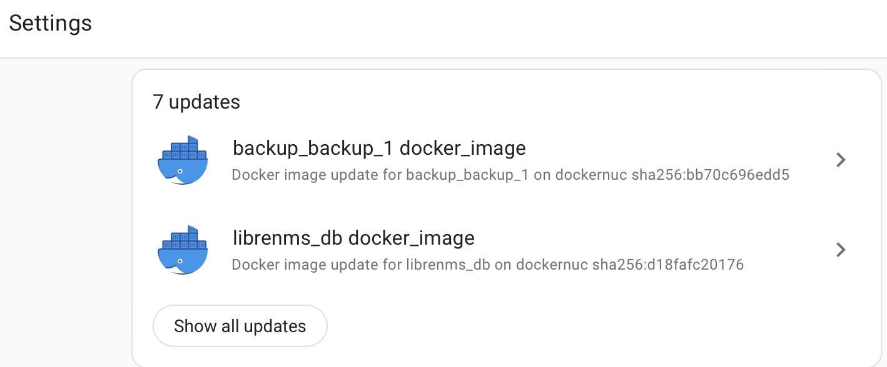

# release2mqtt

Publish new release version info to MQTT, with support for HomeAssistant auto discovery

## Install

### Manual
```
pip install -r requirements.txt
```
### Docker
See ``examples`` directory for a working ``docker-compose.yaml`` which presumes that ``release2mqtt`` has been checked out inside a ``build`` subdirectory of the docker-compose directory.

## Configuration

Create file `config.yaml` in `conf` directory. If the file is not present, a default file will be generated.

Example use of environment variables, e.g. for secrets:

```
mqtt:
    password: ${oc.env:MQTT_PASS}
```

Individual docker containers can have customized entity pictures or release notes, using env variables:

```
    environment:
      - REL2MQTT_PICTURE=https://frigate.video/images/logo.svg
      - REL2MQTT_RELNOTES=https://github.com/blakeblackshear/frigate/releases
```
# Release Support

* Docker  Scan and fetch ( ``docker pull`` ) support. Restart support only for ``docker-compose`` image based containers.
  
  
# HomeAssistant integration

Any updates that have support for automated install will automatically show in the
Home Assistant settings page:



If the package supports automated update, then *Skip* and *Install* buttons will appear on the Home Assistant
interface, and the package can be remotely fetched and the component restarted.
